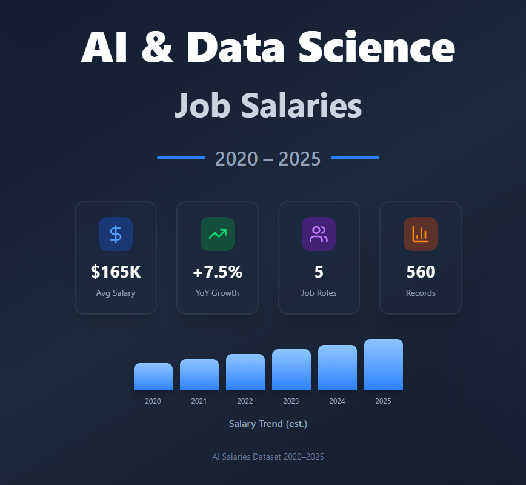

# Global AI & Data Science Salaries (2020–2025)
A multi-country, multi-role synthetic salary dataset with complete EDA, Python/R notebooks, visualizations, benchmarking insights, and structured folders for easy reuse.



---

## 🔗 Quick Access
- **Dataset:** `/data/AI_DS_Salaries_2020_2025.csv`
- **Python Notebook:** `/code/python_eda.ipynb
- **Charts:** `/images/`

---

## 👋 Author
**Pratyush Mishra**  
- **Kaggle:** https://www.kaggle.com/pratyushmishradev  
- **LinkedIn:** https://www.linkedin.com/in/pratyush-mishra-758a0339a/  

---

## 📌 Project Overview
This repository contains a **synthetic yet highly realistic global salary dataset** for AI, ML, and Data Science job roles across the years **2020–2025**.  
It is designed for:

- Exploratory Data Analysis (EDA)  
- Salary trend forecasting  
- HR & compensation benchmarking  
- ML model training  
- Academic research  
- Data storytelling & visualization practice  

---

## 📁 Repository Structure
```
/data
    └── AI_DS_Salaries_2020_2025.csv
/code
    ├── python_eda.ipynb
/images
    ├── thumbnail.png
    ├── salary_trend.png
    ├── role_avg_salary.png
    └── country_salary_comparison.png
README.md
LICENSE
```

---

## 🧠 Dataset Description
The dataset spans **6 years** and includes multiple continents, job roles, and experience levels.

### **Included Columns**
- `year` – 2020 to 2025  
- `country` – India, USA, UK, Canada, Germany, Singapore, Australia  
- `job_title` – Data Scientist, ML Engineer, AI Engineer, Researcher, Analyst, Manager  
- `experience_level` – Entry / Mid / Senior / Expert  
- `salary_usd` – Annual salary converted to USD  
- `employment_type` – FT, PT, Contract  
- `company_size` – S, M, L  

---

## 🔍 Sample Data Preview
| year | country | job_title      | experience_level | salary_usd |
|------|----------|----------------|------------------|-------------|
| 2020 | India    | Data Scientist | Entry            | 21000       |
| 2021 | USA      | ML Engineer    | Mid              | 105000      |
| 2022 | UK       | AI Engineer    | Senior           | 142000      |

(Full dataset available in `/data`.)

---

## 📊 Visualizations (in `/images`)
This repository includes ready-to-use visuals:

- Salary trend (2020–2025)  
- Average salary by AI/DS job roles  
- Country-wise salary comparison  
- Experience level vs salary distribution  

Embed examples (replace after uploading images):

```


```

---

## ▶ How to Use (Python)
```python
import pandas as pd
df = pd.read_csv("data/AI_DS_Salaries_2020_2025.csv")
df.head()

---

## 🎯 Applications
- Market compensation analysis  
- HR salary benchmarking  
- Machine learning salary prediction models  
- AI industry research  
- Visualization & dashboards  
- Portfolio projects  

---

## 🤝 Contributing
Contributions are welcome.  
Feel free to open an **Issue** or submit a **Pull Request** for improvements.

---

## ⭐ Support the Project
If you find this resource useful, please **star the repository**.  
Your support helps the dataset reach more learners, analysts, and researchers.

---

## 📄 License
This project is licensed under the **MIT License**.  
You are free to use, modify, and distribute it with attribution.
